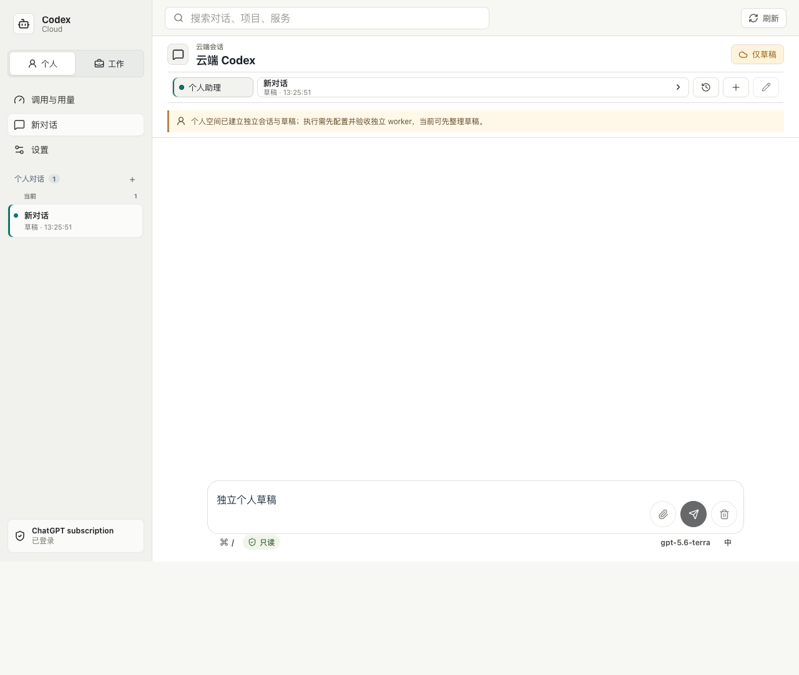
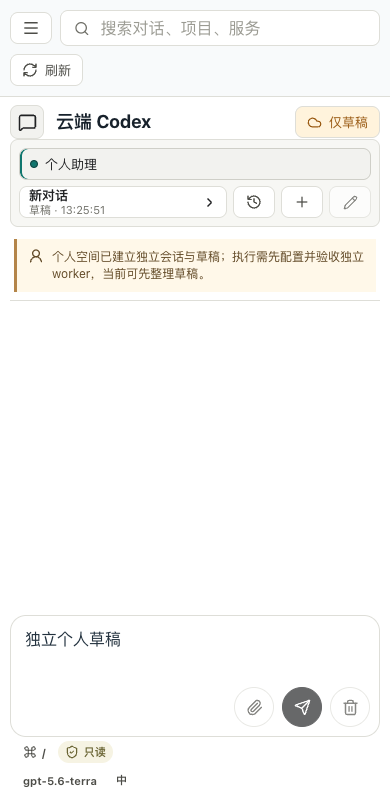
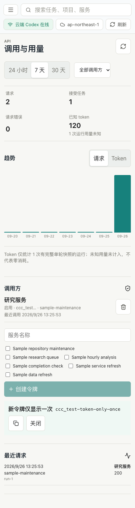

# Personal Agent 首批开发验收与代码 Review

日期：2026-09-26。范围：个人/工作空间、网页审批、独立 API 调用方与用量、移动布局，以及 AWS 上手文档。测试均使用本机临时状态和模拟请求；**没有运行付费模型、修改 AWS 或部署线上服务**。

## 结论

当前是可审查的增量版本，**不是 D1-D4 的上线放行版本**。个人空间已能独立管理非 Git 对话和草稿，但生产环境的模型执行保持关闭；独立 worker、双向文件权限、事务任务队列与预算准入仍是阻断项。外部服务可用独立令牌触发指定自动化并查看管理员侧统计，尚无授权读取结果的外部任务 API。

## 验收证据

| 范围 | 结果 | 证据与限制 |
| --- | --- | --- |
| 构建、schema、运行包 | 通过 | `npm run verify:local`、`npm run verify:runtime`；TypeScript 与 Vite 构建通过 |
| 旧会话、草稿、上传、Webhook、恢复、安装脚本回归 | 通过 | `verify:regressions` 8 组、`verify:safety` 21 项；使用临时目录，不触碰现有任务数据 |
| 审批拒绝/超时/断线/重复、权限范围、用户输入 | 模拟通过 | `verify:approvals` 4 项；未验证真实 CLI 升级后的所有请求变体和页面离线时的人工体验 |
| 独立令牌、范围、撤销、请求曲线、日志损坏恢复 | 模拟通过 | `verify:clients` 3 项及后端回归；令牌只展示一次、存摘要，原共享令牌兼容 |
| token 计算 | 模拟通过 | `verify:usage` 3 项；缓存输入和推理输出不重复相加，已结束运行缺单轮快照时记为未知，排队/运行中不误算；未做真实账单核对 |
| 个人/工作切换、草稿恢复、审批操作、用量页 | 浏览器模拟通过 | `verify:personal:ui`；桌面截图见下方，数据为 Playwright 拦截的假接口 |
| 既有跨项目与 Review 交互 | 浏览器模拟通过 | `verify:safety:ui` 35 项，包含迟到响应、发送失败、草稿冲突和跨项目隔离 |
| 手机布局 | 浏览器模拟通过 | 320、360、390、430、768、820、1280px 无整页横向溢出，用量页主要控件触控区域至少 44×44px，390px 侧栏完成个人/工作往返；未做 iOS/Android 真机、键盘、安全区及屏幕阅读器验收 |
| AWS 指南与项目 Skill | 文档完成 | 注册、费用、实例选型、连接和部署步骤已串联；未创建资源或在新账号上实操 |

### 路线图编号状态

| 编号 | 状态 | 本轮判断 |
| --- | --- | --- |
| PA-01 | 部分通过 | 对话与草稿往返恢复；附件、滚动位置及运行中切换未完整覆盖 |
| PA-02/03/04 | 未放行 | 搜索与会话有空间键和服务端归属检查；模型输入隔离及独立 worker 双向权限尚未验收 |
| PA-05 | 模拟通过 | 审批逐项绑定摘要、一次性决定，拒绝/超时/断线 fail-closed；跨进程恢复尚无持久待办 |
| PA-06 | 部分通过 | 非 Git 个人空间可建立草稿，旧回归通过；旧生产数据迁移未现场验收 |
| API-01/02/06 | 部分通过 | 令牌按自动化授权、撤销、请求摘要幂等与失败重放已测试；客户端并发/预算、跨客户端结果读取未实现 |
| API-03/04 | 模拟通过 | 完整单轮快照取最终值；缓存与推理子字段不叠加；缺失值标未知 |
| API-05/07 | 部分通过 | 管理员页有请求和已知 token 曲线；多次恢复计量、时区/DST、90/365 天汇总和账单对账未验证 |
| MOB-01/04 | 部分通过 | Chromium 宽度和旧交互回归通过；横屏、真实弱网及手机后台恢复未覆盖 |
| MOB-02/03/05/06 | 未验证 | 真机、无障碍、性能 P95 与 Service Worker 升级门槛待验收 |
| CORE-01 | 模拟通过 | 不再自动批准命令/文件/额外权限；真实 CLI 协议矩阵仍需现场验收 |
| CORE-02/03/04/05/06/07/08、OPS-01 | 未放行 | 外部 token 不提供审批接口；其余可靠队列、全局预算、动作回执、产物校验和真实备份恢复仍未完成 |

## Review 记录

| 优先级 | 发现 | 处理与复验 |
| --- | --- | --- |
| P1 已修复 | 快速切换空间时输入框短暂可编辑，随后的历史加载可能覆盖新输入 | 切换同步进入加载态；E2E 验证个人草稿往返恢复，旧草稿保护回归通过 |
| P1 已修复 | 把全部请求明细和令牌保存在单一 JSON，每次请求重写历史，鉴权也需读取大文件 | 令牌元数据独立；请求按日追加 0600 日志，读取只扫描时间段，损坏行显式计数；30 天内的新指标保留，未改旧任务文件 |
| P1 已修复 | 独立服务仍按来源 IP 限流，可换 IP 绕过或互相牵连 | 独立令牌改按客户端 ID；旧共享令牌保留 IP 限流，单测通过 |
| P1 已修复 | 仅前端禁用个人空间附件，可直接调用流接口 | 服务端拒绝个人附件；生产个人执行默认关闭，回归验证聊天与文件写入被拒绝 |
| P1 已修复 | 不安全的同用户个人预览可能在生产误启用 | `CODEX_PERSONAL_PREVIEW=1` 仅非生产生效；页面和文档明确不具备权限隔离 |
| P2 已优化 | 每次独立调用都会重写最近调用时间 | 限为约每分钟一次，单测验证突发请求不重复写元数据 |
| P2 已修复 | 未结束的任务被计入“用量未知”，造成覆盖率误报 | 仅对终态运行计算已知/未知，补模拟用例 |

新增模块只承载真实边界：审批 broker、调用方及请求日志、单轮用量计算；用量页延迟加载。没有引入第二套聊天引擎、SQLite/队列依赖或独立任务模型。现有 Webhook/Heartbeat、项目与会话仍是唯一执行入口。

## 未完成与上线门槛

1. **P0：独立 worker 与双向权限。** 个人执行不能因前端隔离或只读提示词就开放生产；需独立系统用户、HOME/CODEX_HOME、环境白名单、内部服务和元数据访问隔离，并用假秘密做实际越权测试。
2. **P0：可靠任务与成本准入。** 当前仍沿用旧自动化运行存储；没有事务接收、租约、全局/客户端并发及预算硬门槛。部署后真实审批会使部分无人值守任务超时拒绝，应先确认任务影响和人工处理路径。
3. **P1：计量覆盖。** 请求日志默认保留 30 天，但尚无长期汇总；运行缺完整单轮快照时只记“未知”，不代表零消耗，也不等于账单。
4. **P1：外部读取契约。** 独立令牌目前只能触发指定自动化，不能授权取回私有任务结果、产物或 SSE；Muse/Today/Grok Bot 的实际连接入口未验证。
5. **P1：真实环境验收。** 未在 EC2 现有任务和状态目录上执行迁移、备份恢复、真机/弱网测试或付费模型调用；不能据本报告宣布线上可用。

下一阶段按[统一路线图](../personal-agent-roadmap.md)继续，不以推送 GitHub 代替上线批准。
